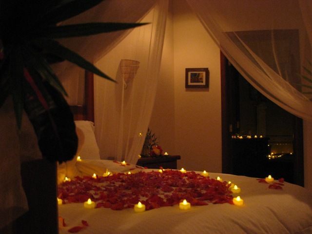
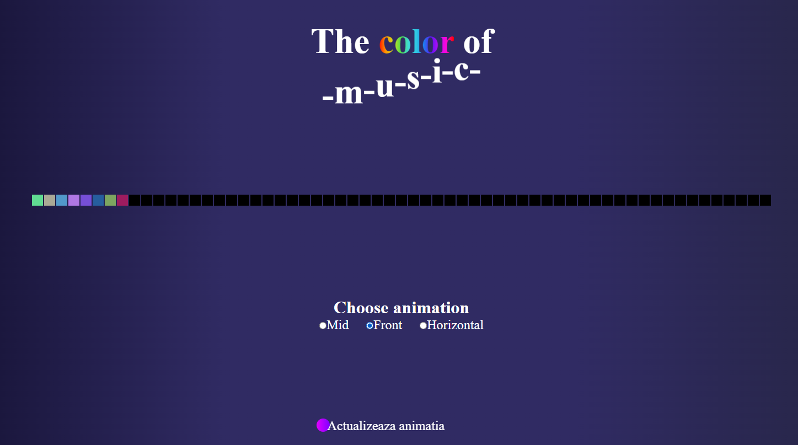

# Proiect PMP - Banda Led Adresabila controlata remote

[Demo YouTube proiect](https://youtu.be/3Po3nyhH-xo)
[Demo muzica techno](https://youtu.be/AhxSv9iKTik)
## Motivatie

Sunt multe motive pentru care ai alege sa faci o banda adresabila pe muzica/sunet. Un motiv foarte bun este cand vine cineva pe la tine (de preferat nu de la ingineri)

> [image source](https://i.pinimg.com/originals/12/9c/83/129c83dffec7d33f262780034a4cf422.jpg)

Astfel poti realiza o seara cat mai romantica (daca estee cazul) sau chiar sa faci impresie buna cu talentele tale ingineresti.

De asemenea, poti avea o atmosfera mult mai luminata/colorata seara cand te joci pe calculator sau citesti articole sau vizualizezi conferinte de programare. Poate fi folosit, de ce nu, si in perioada sarbatorilor pentru a da culoare sau animatie.

De asemenea poate fi un decor potrivit pentru biroul personal.

## Inspiratie

Aceasta idee provine din liceu, in principiu, dupa ce am vazut un videoclip pe youtube, care in prezent numara aproape 2 milioane de vizualizari

[Sursa videoclip si poze](https://youtu.be/lU1GVVU9gLU)

## Utilizare

- se porneste placuta Raspberry Pi (aceasta alimenteaza si placuta Arduino Nano, care la randul sau alimenteaza senzorul de sunet cat si banda LED adresabila)
- se conecteaza prin SSH (sau prin monitor + tastatura + mouse) pentru a se porni server-ul aflat in fisierul _main.py_ din folder-ul _src/_
- se conecteaza la ip-ul placii arduino dupa care la portul 8080 unde este legat server-ul de Flask
- Acum se poate folosi pagina web, pe care sunt disponibile cele 3 animatii: Mid, Front si Horizontal,
  de asemenea se gasesc si niste "simulari" ale acestora pe mijloc, tin sa precizez faptul ca aceste previzualizari sunt complet aleatoare, nu sunt influentate de sunet iar culorile sunt generate aleator (cat si inaltimea pentru animatia de _Horizontal_). Mai jos sunt niste capturi de ecran ale site-ului

### Animatia de tip Front

### Animatia de tip Mid

### Animatia de tip Horizontal

- Dupa ce s-a ales animatia, se apasa pe butonul de **Actualizeaza Animata**, iar rezultatul, daca esti conectat la server prin ssh sau poti vedea consola, se va vedea in consola.
  

## Arhitectura

Dupa cum am spus si anterior, se bazeaza pe o arhitectura de tipul master&slave, placuta raspberryPi gazduieste server-ul web (scris folosind framework-ul Flask), cand se face un PUT, server-ul activeaza pinii GPIO_25 (pentru intrerupere) si GPIO_23/24 (pentru codul binar, transmis in paralel), astfel se activeaza intreruperea de pe placuta arduinoNano care schimba codul animatiei.

Folosind placuta raspberryPi obtinem o interactivitate mai mare in reteaua locala de internet, astfel, schimbul animatiei se face cu o pagina web usor de utilizat.

